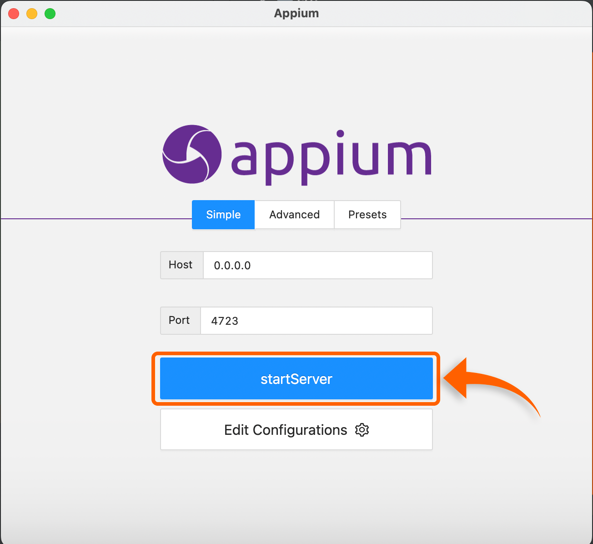

<div align="center">

# Desafio QA - Automação
    
</div>

Foi feito um projeto completo utilizando as tecnologias abaixo:

- **Java** - Linguagem de programação utilizada;
- **Maven** - Para gerenciar as dependências do projeto;
- **Cucumber** - Para utilizar o BDD na automação;
- **Appium** - Framework de Testes Automatizados para mobile.

## Arquitetura do Projeto

<div align="center">


**1° Imagem:** Aquitetura dos Testes Automatizados.

</div>

<div align="center">

## PASSO A PASSO PARA EXECUTAR AUTOMAÇÃO

</div>

### 1° - É necessário ter as seguintes tecnologias instaladas:


- *[Java](https://www.java.com/pt-BR/) (18.0.2);*
- *[Maven](https://maven.apache.org/) (3.8.1);*
- *[Appium](https://appium.io/) (1.22.3-4);*
- *[Android Studio Chipmunk](https://developer.android.com/?hl=pt) (2021.2.1);*
- *[Intellij IDEA CE (Community Edition)](https://developer.android.com/?hl=pt) (2022.2).*


### 2° - Abrir o Simulador:
1. Abrir o **[Android Studio](https://developer.android.com/studio)**, clicar em "**More Action**" -> "**Virtual Device Manager**";
2. Para a execução do teste automatizado foi utilizado o dispositivo:

    - **Dispositivo:** *Pixel 3a*
    - **Resolution:** *1080 x 2220 - 440dpi*
    - **Target:** *Android 12.0 (Google APIs)*

### 3° - Executar o Appium:


<div align="center">



**2° Imagem:** Mostrando a opção "**startServer**" para iniciar o servidor do Appium.

</div>

### 4° - Clonar o projeto do *[GitHub](https://github.com/)*:

```bash
    # CLONAR REPOSITÓRIO DA AUTOMAÇÃO
    git clone https://github.com/jacksonhmteixeira/BuildersDesafioAutomationJackson.git
```
### 5° - Abrir o projeto no *[Intellij](https://www.jetbrains.com/pt-br/pycharm/download/#section=windows)*:

Para o desenvolvimento do teste automatizado foi utilizado o Intellij Community, no entanto, é recomendado ter a ferramenta instalada na máquina. Caso tenha instalado corretamente, abra o projeto clonado do GitHub.

### 6° - Alterar o local do arquivo "*[challenge-qa.apk](https://github.com/jacksonhmteixeira/QAStoneAutomation/tree/main/Apk)*".

Para executar o projeto, é necessário apontar o caminho correto do APK. Para realizar a alteração segue a descrição da imagem:

- **Caminho**: *src/test/java/com/builders/desafio/config/AppiumDriverConfig.java*.

<div align="center">


**3° Imagem:** Caminho para a alteração do local do arquivo APK.

</div>

### 6° - Arquivo para execução:

Para executar a automação, clicar com o botão direito na classe "**Runner**", selecionar a opção "**Run 'Runner'**":

<div align="center">


**4° Imagem:** Local para clicar e executar a automação.

</div>

### Resultado obtido pela automação:

Após a executar do teste automatizado, no log é apresentado o resultado da execução com o link que pode ser visualizado o "**Report**" no Browser. 
Abaixo está a demonstração:

<div align="center">


**5° Imagem**: Log com o link para o Report no browser. 


**6° Imagem**: "**Report**" da execução do teste automatizado.

</div>
